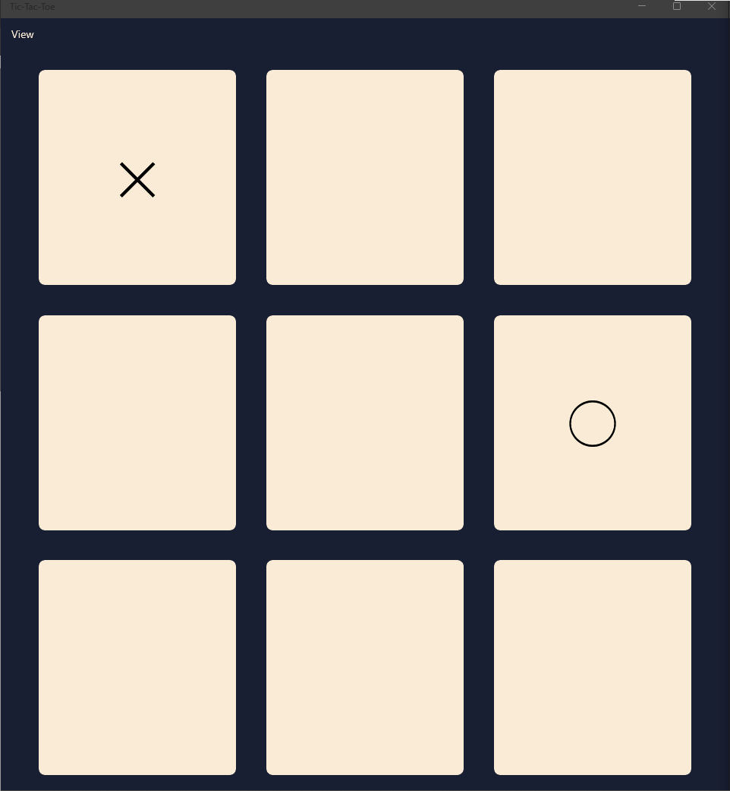
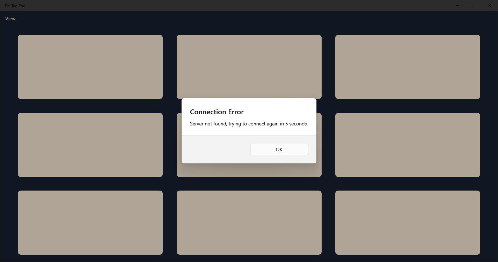

# Tic-Tac-Toe Game

A tic-tac-toe game made in C# and MAUI.

Fully functional with TCP sever and error checking.

Instructions:
1. Configure ip and port in server and game(optional)
2. Start server process
3. Start 2 game processes
4. Have fun playing this timeless classic!

